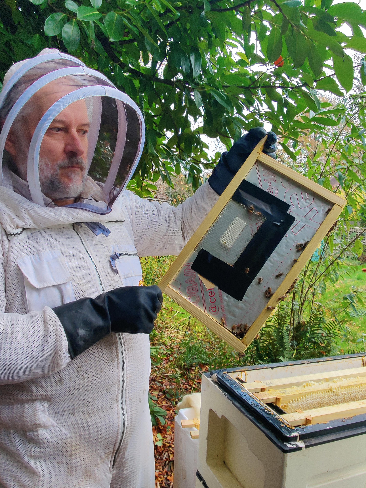
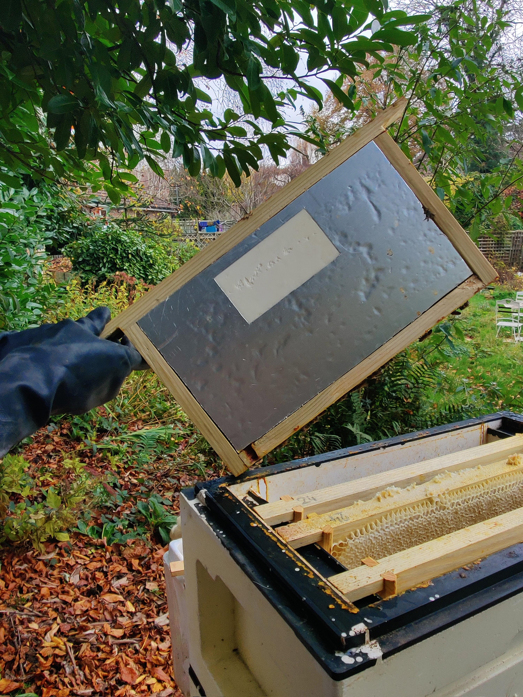
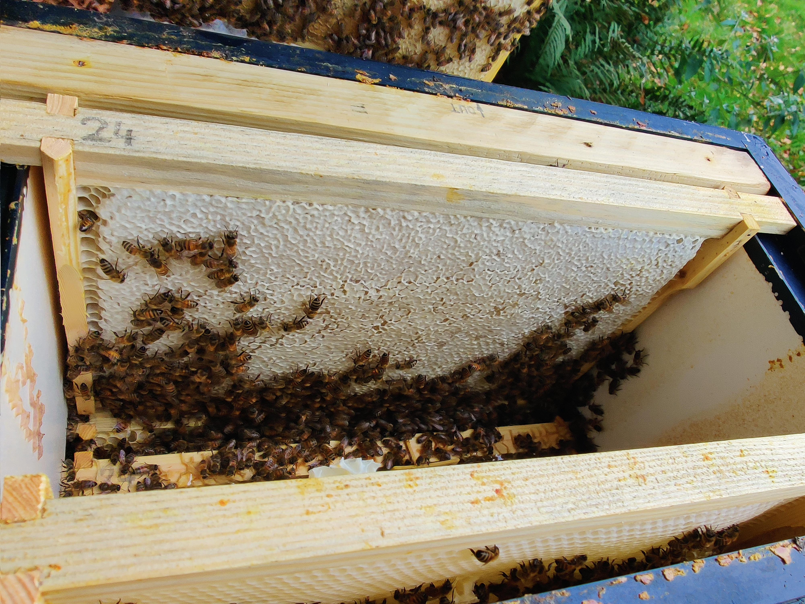
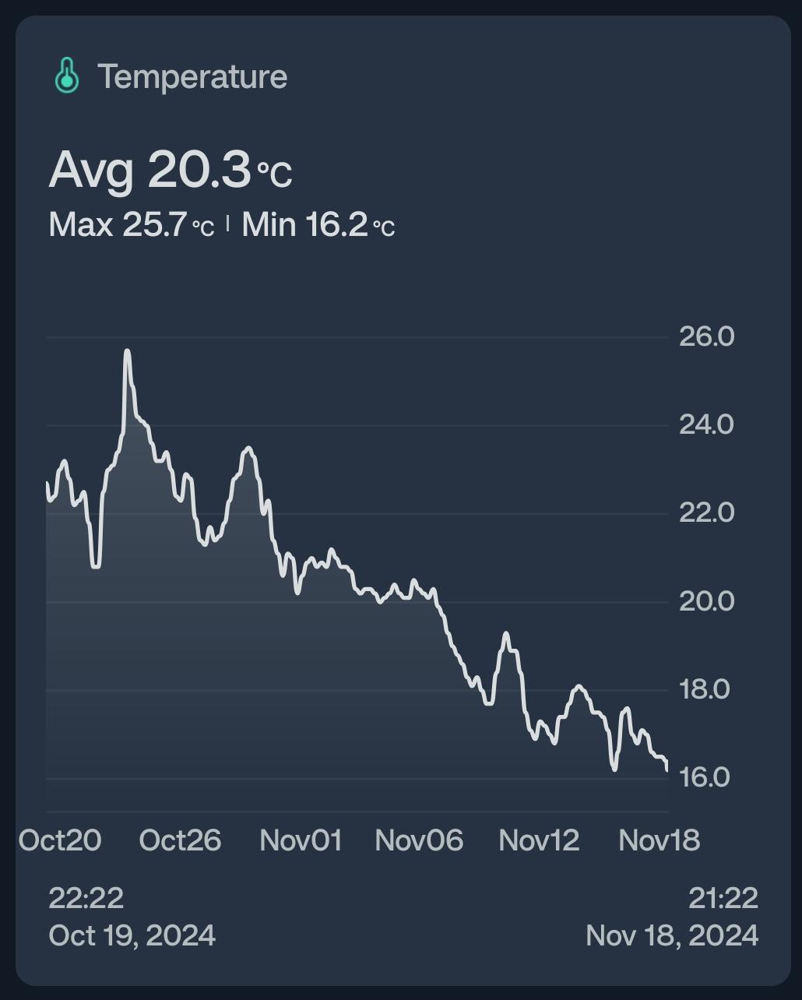
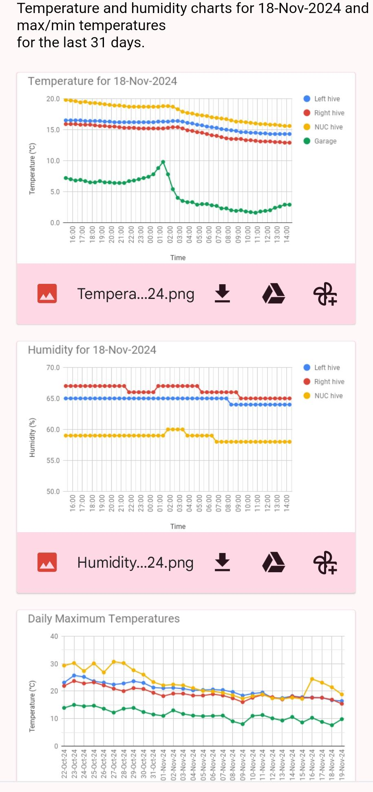

# hivemonitor

## Steps and code to build a temperature and humidity monitoring system with SwitchBot temperature and humidity sensors.

Introduction is in ["hivemonitor.pdf"](hivemonitor.pdf) - it describes the components used 
(with Amazon links valid in Nov 2024) and how sensors can be fitted into a hive. 

It is possible to run the system without a hub by directly receiving Bluetooth data on your smartphone. It works but, apart from not being able to automate
the system, you would lose an ability to monitor the hives' when you are not in the vicinity. I found that a statonary hub located closer to the hives is 
pretty useful even before automation is added.

### Steps listed in the ["hivemonitor.pdf"](hivemonitor.pdf) include:
  - procuring sensors and a "mini-hub" (directly from switch-bot.com or via Amazon)
     - sensors: https://www.switch-bot.com/products/switchbot-indoor-outdoor-thermo-hygrometer
     - mini-hub: https://www.switch-bot.com/products/switchbot-hub-mini
  - building frames for sensors (a DIY job)
  - fitting frames with sensors into your hive(s)
  - installing SwitchBot app
     <ins>**Important:** When an app asks if sensor data should be stored in the cloud say "Yes". It will be needed for automating the system.</ins>
  - connecting the "mini-hub" to Wifi and to the Internet (follow instructions which come with the hub)
     <ins>**Important:** Adding a hub is not absolutely necessary if you plan to only collect sensor data with your smartphone near the hives.</ins>
  - establishing communication between the app and the sensors (follow instructions which come with the sensors)
  - verifying the graphs in the app work well (you can give hives individual names).

When you set it up so that the app shows and updates the graphs you will be able to take the next step and automate the system. Why not? It is free anyway!

### Steps required for automatic alerting and daily Email reports:
  - use your Google account (create one if necessary), go to https://docs.google.com/spreadsheets and create a sheet
  - go into your SwitchBot app, then into Profile/Preferences/About/Developer Options
  - get a token string (it also shows a Secret Key - you will not need it)
  - in Google Sheet select "Extensions"/"Apps script" and paste there the script code from ["hivemonitor.as"](hivemonitor.as) file
  - edit the top of the script and insert your token into this line: const token = 'your token here';
  - edit the script to insert your Email (daily reports will be sent there) - it works best with gmail (which expands attached graphs so you can see them instantly)
     <ins>**Note**: Only devices with a "hive" in their name (as given in the app) will be included into charts and will generate alerts about extreme temperature and humidity.
    To give any device a descriptive name which includes "hive" string, go into the settings of each device in SwitchBot app.</ins>
  - edit the script to adjust the critical levels of temperature and humidity
  - save the script (an icon at the top which looks like a small floppy disk; if you know what it looks like :-)
  - press the Triggers icon on the left side (it looks like an alarm clock)
    - create a trigger to run logSensorData() every 1 hour (or even every 2 hours - this may allow sensors' batteries to run a bit longer)
     <ins>**Note:** Blue button [+  Add trigger ] is in a bit of an unexpected position in the bottom right corner of the screen.</ins>
    - create a trigger to run createDailyCharts() once a day (I set it to just after midnight so that graphs reflect 24h of the last day)
  - to test how the script works you can manually use "Run" icon at the top while selecting either logSensorData() or createDailyCharts() to the right of the "Run" icon
     <ins>**Hint:** Initially use "Run" with logSensorData() several times with a few minutes interval because you need some data records to produce charts.
    (If any error occurs it will be reported at the bottom.)</ins>
     <ins>**Note**: Sending Emails from a script is considered an unsafe operation (due to spam risks) - you will need to explicitly allow it when Google Sheets ask.</ins>

If you need help, find any bug, have any comments or ideas, please Email me - you can find the address at the bottom of ["hivemonitor.pdf"](hivemonitor.pdf).

  
  
  
  

